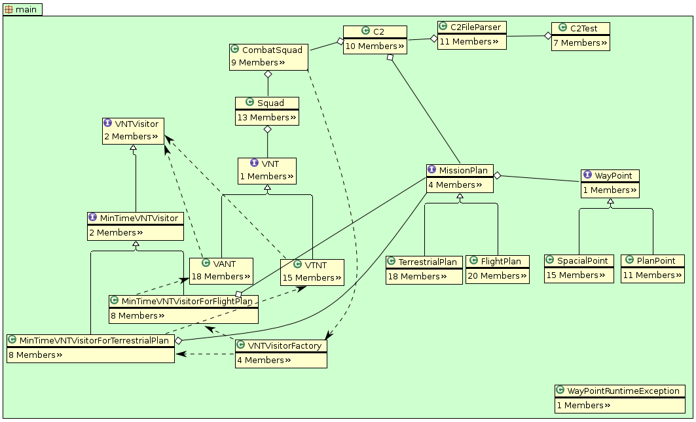

=================
 Exame de CES-22
=================

:Autor: Alexandre Hideki Deguchi Martani
:Autor: Dalton Vinicius Teixeira Pinto
:Data: 14 de dezembro de 2009
:Professor: José M Parente de Oliveira
:Assunto: Modelos, coleções, loops e testes.

Introdução
==========

Neste laboratório, foi implementado uma versão inicial de um software de
planejamento e controle de tropas equipadas com Veículos Aéreos Não Tripulados
(UAVs).
Nesta versão, o software permite gerenciar um conjunto de tropas munidos de
UAVs e ler planos de voos, e a partir destes informar as tropas mais aptas a
executar cada plano de voo e a capacidade de resposta ótima.

Com este trabalho, adquiriu-se experiência prática com tópicos importantes de
orientação a objetos, tais como:

 * Modelagem de classes, objetos e métodos;
 * Exploração da API Java de coleções; e
 * Utilização de testes para provar a correção da implementação.

Materiais e Métodos
===================

Para a execução desta tarefa, foram necessários conhecimentos teóricos de
modelagem de classes, da utilização de coleções da linguagem Java, e de
criação de testes.

Os materiais utilizados foram os seguintes:

 * Linguagem de programação Java;
 * Framework de testes JUnit; e
 * IDE Eclipse 2.5.

A modelagem utilizada para a resolução do problema é mostrada a seguir.

O modelo proposto atende completamente a especificação, na medida que
armazena todas as informações requeridas na mesma e com os devidos
relacionamentos necessários, sendo suficiente para a resolução do problema.

A implementação iniciou-se com um pacote de classes fornecido pelo professor,
que incluia a implementação parcial das classes ``WayPoint``, ``FlightPlan``,
``UAV``, ``Squad`` e ``CombatSquad``. Do modo como foi fornecido, o pacote não
atende completamente o modelo, devido à ausência da classe ``C2``.
Foi implementada a classe ``C2``, que manipula os objetos
das classes anteriores a fim de obter as informações desejadas.
Com isso, todas as classes do modelo foram implementadas da forma especificada,
atendendo o mesmo.

Para fins práticos, foi criada a classe ``C2FileParser``, responsável por ler
os arquivos fornecidos com as descrições das tropas, rotas e UAVs e alimentar
o objeto da classe ``C2``.

Para testar o funcionamento destas classes, criou-se a classe de testes 
``C2Test``, que utiliza as classes criadas de forma a obter as informações desejadas.

O código-fonte do programa encontra-se em anexo.

Análise de Resultados
=====================

A massa de dados utilizada foi fornecida pelo professor, e encontra-se junto ao
código-fonte do programa, na pasta ``data``.

O resultado da execução do programa é mostrado abaixo::

    Tempo de cada pelotao:
    Plano 1
    charlie: 70,79 min
    alfa: 56,47 min
    bravo: 54,14 min
    Plano 2
    charlie: 53,04 min
    alfa: 53,16 min
    bravo: 53,20 min
    Plano 3
    charlie: 53,02 min
    alfa: 53,14 min
    bravo: 53,18 min

    Menor tempo para cada missao:
    Plano 1
    bravo: 54,14 min
    Plano 2
    charlie: 53,04 min
    Plano 3
    charlie: 53,02 min

Os resultados obtidos foram satisfatórios, respondendo corretamente a solicitação.

Conclusões
==========

 * O paradigma de programação orientado a objetos permite a construção de sistemas
   complexos de forma metódica, tornando o desenvolvimento mais organizado e
   eficiente;
 * A API de coleções da linguagem Java contém ferramentas de grande utilidade ao
   expor métodos prontos para diversas tarefas comuns ao lidar com conjuntos de
   objetos; e
 * O laboratório permitiu ao aluno adquirir experiência com a programação orientada
   a objetos e a utilização de ferramentas da biblioteca nativa da linguagem Java.

